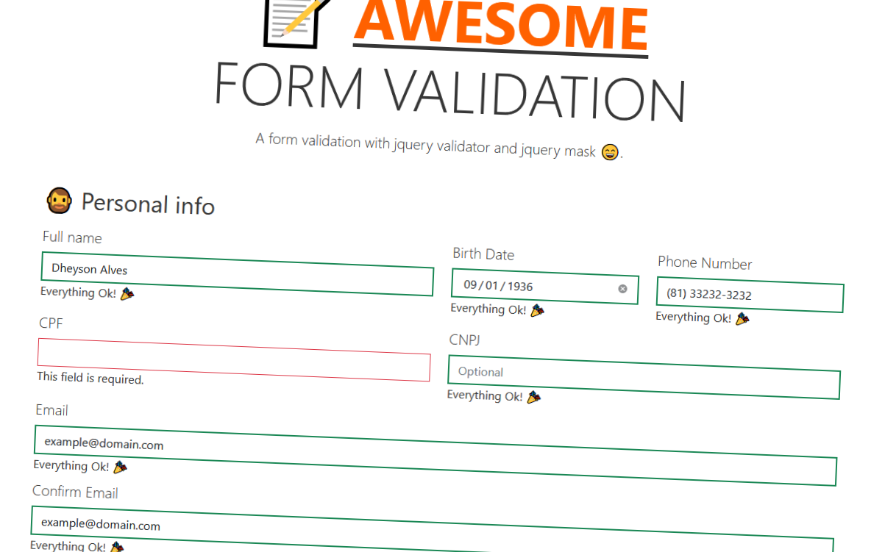

# Introdução

Toda vez que iniciava a criar um formulário, eu pensava, _"Estou fazendo algo que já fiz, eu devia reutilizar de algum lugar"._ Eu tinha essa necessidade toda vez, embora exista bastantes modelos na internet, queria um em que eu sabia diretamente onde encontrar, principalmente para formulários em um ambiente JavaScript Puro ou JQUERY. Então pensei em criar um padrão para mim, pensando nos principais casos para formulários.

## A Estrutura do Projeto

No mundo de JQUERY, existem bastantes plugins para lidar com formulários, seja para validações, ou para máscaras. Busquei utilizar o JQUERY Validator com o JQUERY Plugin Mask. O nome de ambos já informa para que serve cada um, e acho que foi um casamento bom dos dois plugins.

Nos estilos, busquei o bootstrap 5 beta, uma versão que está livre para testes, que também tem novidades, principalmente para a forma de utilizar as suas classes, comentarei mais a frente.

Sobre os campos do formulário, busquei utilizar alguns campos comuns para um usuário padrão, e também informações de pagamento com cartão de crédito. No qual, acredito cobrir boa parte dos tipos de formulário que já enfrentei.

Criei um repositório no Github, para armazenar o projeto. Sempre quando crio meus projetos por lá, deixo bem organizado para contribuições, então caso queira dar uma olhada e como contribuir no projeto final, segue link: [Github link](https://github.com/Dheyson/awesome-form-jquery-validator)

E aqui você pode ver uma demo: [Demo](https://dheyson.github.io/awesome-form-jquery-validator/index.html)

## Os Plugins de Validação

Ambas as ferramentas são bem customizáveis, podendo adicionar regras de várias formas, seja as _built-in_ ou suas próprias. Vou passar por cada uma, com exemplos do código do projeto, e também apresentando meus desafios.

### JQUERY Validation Plugin

Sua configuração é simples, basta adicionar os arquivos baixados da documentação oficial, nas tags script do HTML principal, e está pronto para utilizar.

```html
<script *type*="text/javascript" *src*="js/jquery.validate.min.js"></script>    
<script *type*="text/javascript" *src*="js/additional-methods.min.js"></script>
<script *type*="text/javascript" *src*="js/localization/messages_pt_BR.min.js"></script>
```

Um arquivo que se mostrou bastante útil também, é o de mensagens, onde é guardado os textos padrões para as principais regras do plugin. O que me ajudou a economizar tempo, escrevendo textos para os erros padrões.

Certo, configurado o acesso ao plugin, agora vamos a obra.

Uma pequena observação: Não vou focar neste artigo no HTML, mas apenas nas validações do form, então vou deixar um link para o arquivo do HTML completo, se quiser ver em detalhes. Mas basicamente, as regras se aplicam a cada input específico.

[Html do projeto](https://github.com/Dheyson/awesome-form-jquery-validator/blob/main/index.html)

Primeiro definimos qual form será validado, no nosso caso, é o:

```html
<form class="row g-3" id="awesome-form"></form>
```

Então, no arquivo de script, criamos essa estrutura:

```javascript
$('#awesome-form').validate({
  debug: true,
  rules: {
    fullnameinput: {
      required: true,
    },
    inputBirthData: {
      required: true,
      date: true,
    },
    inputPhoneNumber: {
      required: true,
      pattern: /\(\d{2,}\) \d{4,}\-\d{4}/,
    },
    inputCPF: {
      cpfBR: true,
      required: true,
    },
    inputCNPJ: {
      cnpjBR: true,
    },
    inputEmail: {
      email: true,
      required: true,
    },
    inputConfirmEmail: {
      equalTo: '#inputEmail',
      required: true,
    },
    inputZip: {
      postalcodeBR: true,
    },
    inputCardNumber: {
      creditcard: true,
      required: true,
    },
    inputPrintName: {
      letterswithbasicpunc: true,
      required: true,
    },
    inputAddress: {
      required: true,
    },
    inputCity: {
      required: true,
    },
    inputPassword: {
      required: true,
      pattern: /^(?=.*[a-z])(?=.*[A-Z])(?=.*[0-9])(?=.*[!@#\$%\^&\*])(?=.{8,})/,
    },
    inputNeight: {
      required: true,
    },
    inputMonthCard: {
      required: true,
      pattern: /^(0?[1-9]|1[012])$/,
      min: 01,
      max: 12,
      digits: true,
    },
    inputYearCard: {
      required: true,
      min: 18,
      max: 28,
    },
    inputCVV: {
      required: true,
      pattern: /^[0-9]{3,4}$/,
    },
  },
  validClass: 'border-success border-2',
  errorClass: 'border-danger border-2',
  success: function (label) {
    label.addClass('valid').text('Everything Ok! 🎉');
  },
  submitHandler: function (form) {
    form.submit();
  },
});
```

Embora possamos adicionar outras opções, para nosso caso, vamos precisar apenas desses. Vou explicar cada atributo abaixo:

- debug

O atributo, permite receber no console, qualquer erro da validação ou sucesso de validação, ele evita a submissão do formulário para apresentar essas informações. Ele faz o debug também de campos com nomes impróprios para formulário.

- rules

Apresenta as regras dos inputs do formulário. Existem bastantes regras padrões do plugin, mas o melhor, é a possibilidade de criar métodos separados para o plugin e adicionar como uma regra. Seja um simples regex, ou um algoritmo complexo. Na documentação, ele apresenta uma lista de bastante casos pensados pela comunidade: [Validações customizados](https://github.com/jquery-validation/jquery-validation/tree/master/src/additional)

- validClass

Adiciona o estilo no input caso ele seja validado pelo rules, ele fica escutando se o campo foi validado.

- errorClass

O mesmo caso anterior, mas para errors dos campos.

- success

Adiciona uma label quando o campo for validado.

- submitHandler

Evento para submeter o formulário, após validação dos campos.

Esses são os atributos padrões do formulário que estamos utilizando, na próxima parte vamos entrar em detalhes sobre como está sendo feito as validações com o regex e os métodos customizados nas regras.
