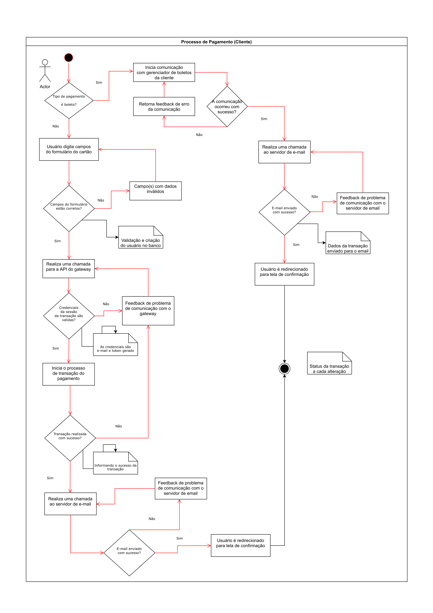
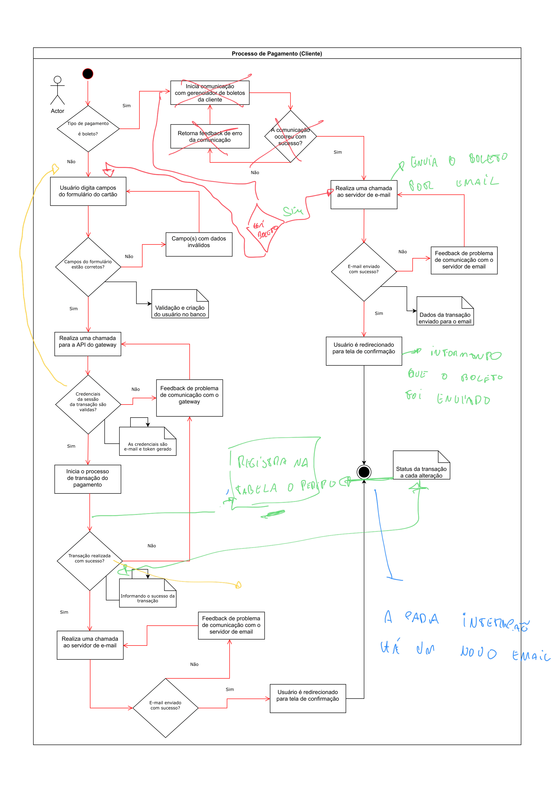

## Introdução

Eu havia comentado em algum artigo anterior, que este ano, seria de muitos desafios. Daqueles que realmente te tiram da zona de conforto. Meu primeiro grande projeto na empresa, era integrar um sistema com o PagSeguro, um gateway de pagamento bastante utilizado no Brasil.

A plataforma era para um Ambiente de Coworking, e será possível realizar comprar de eventos, assinaturas de planos, entre outros serviços. No início fiquei intimidado pela tempo do deadline, mas busquei fazer o melhor, e logo recalibrei o foco.

Para o artigo não ficar muito grande, dividirei o mesmo em três partes. Sendo está a primeira parte.

## O planejamento

Como deve ser, busquei junto com meu coordenador planejar as atividades. Analisei o escopo, o protótipo e a API do PagSeguro para dar inicio ao planejamento. Com o suporte do coordenador, planejei a arquitetura do fluxo de pagamento, baseado também na estrutura idealizada no projeto.

O módulo que estava implementando, era o de compra de um Evento, que envolvia a compra pelas três formas de pagamento, Cartão de Crédito, débito online e boleto. Mas vou me atentar nessa sessão sobre o planejamento, depois volto para os detalhes de implementação do PagSeguro.

Para planejar o módulo de pagamento, criei um diagrama de atividades, ou mais conhecido como UML. É um modelo para prototipação de atividades, seguindo a lógica do fluxo de uma funcionalidade ou mais de uma. Segue abaixo o diagrama criado:

Diagrama de Atividades - UML

Vou seguir explicando o fluxo pensado inicialmente, e depois as pequenas alterações que tive junto com meu coordenador. Apenas como pequena revisão da nomenclatura:

1. Os losangos são os condicionais;
2. Os retângulos são as ações do usuário ou sistema;
3. Os retângulos com ponta dobrada na borda são anotações.
4. O círculo preenchido é o início do processo;
5. O personagem é a persona ou usuário do sistema que inicia o fluxo;
6. O círculo com border branca indica o fim do processo;
7. As setas são a direção das ações;

Pronto, feito um pequeno resumo, agora podemos prosseguir com a explicação.

Nesse fluxo, possuímos três formas de pagamento, como comentado anteriormente, mas existe um pequeno detalhe a respeito do boleto. Eu tinha dois cenários, um pagamento processado pelo PagSeguro e outro poderia ser colocado pelo cliente no gerenciador da plataforma. Por isso a divisão do fluxo acima.

Vou iniciar pelo fluxo de cartão de crédito, o usuário deve digitar os campos de cartão de crédito, caso os dados estejam validados ele segue o fluxo, caso contrário ele retorna aos campos.

Após validado, realizamos uma chamada a API do PagSeguro pegando todos os dados necessários para realizar a transação. Validamos e caso ocorra algum erro na conexão com a API, retornamos um feedback de erro.

Após a validação da transação, salvamos os dados no banco e depois realizamos um disparo ao servidor de e-mail, informando do pedido realizado e do status da transação. No final do processo, ficamos escutando através de um webhook, a atualização de status de uma transação.

Mostrei para meu coordenador o fluxo, e ele me auxiliou, realizando umas pequenas modificações no fluxo, segue as anotações:

Alterações no fluxo

No fluxo dos três pagamentos, temos a validação da sessão do pagseguro, essa foi uma das primeiras modificações. Mantendo o resto de fluxo de feedback e validações. No fluxo de boleto bancário, validamos caso exista um input de e-mail enviado do cliente, caso exista é disparado um e-mail, caso não, seguimos o fluxo salvando os dados no banco e enviando os e-mails com status da transação do PagSeguro.

Todo esse fluxo aborta o modelo de pagamento, onde contenta as três formas de pagamento, o armazenando no banco de dados e o disparo de e-mail.

## As Modificações

No fluxo de compra de um evento, o usuário poderá se cadastrar no sistema, caso não seja registrado. O formulário comportava alguns campos padrões de usuário, mas faltava informações de endereço. No PagSeguro, para a forma de pagamento com Cartão de Crédito, ter o endereço do pagador, são obrigatórios, onde tive que ter uma conversa com a equipe de Design e requisitos para a pequena modificação.

Os requisitos comportavam também, Cartão de Débito, no entanto, no PagSeguro pelo Checkout Transparente, ele permite apenas Débito Online. A transação é realizada pelo banco selecionado, que é disponibilizado pelo PagSeguro também.

A última modificação, era a seleção de parcelas, que na seção de cartão de crédito, não comportava a seleção, embora no fluxo, evento deve ser comprado apenas uma vez, era necessário, informado pelo PagSeguro.

Algumas pequenas modificações, que apenas observei durante o desenvolvimento, mas que pude alinhar bem junto com as outras equipes para comportar os dados que iria precisar na integração.

---

Por aqui fizalizamos a primeira parte do artigo.
