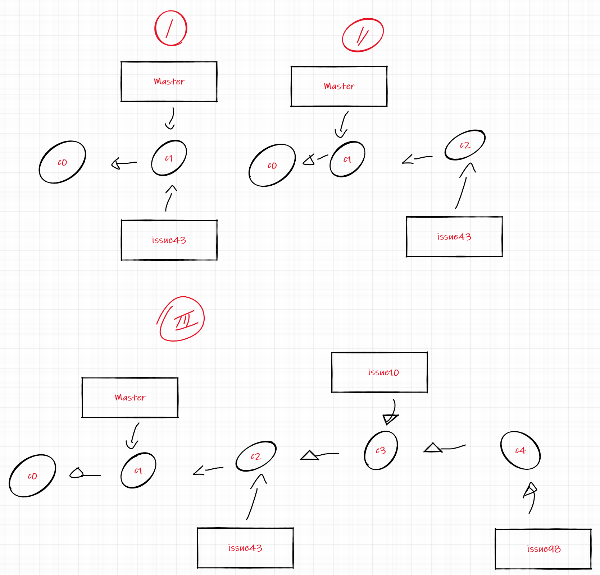

<!-- <div style="color: orange; border: 2px solid #363636; display: inline-block; padding: 5px; margin-bottom: 10px; border-radius: 10px; background-color: lightyellow;">
	<label>Meu coworker perguntou</label>
</div> -->


Photo by [Sajad Nori](https://unsplash.com/@sajad_sqs9966b?utm_source=unsplash&amp;utm_medium=referral&amp;utm_content=creditCopyText) on [Unsplash](https://unsplash.com/?utm_source=unsplash&amp;utm_medium=referral&amp;utm_content=creditCopyText)

Um colega de trabalho me fez essa pergunta, ele estava com um cenário específico, possuía três branches para realizar o *merge* com a branch pai, no entanto, todas estava dessincronizadas.

Vou desenhar o cenário específico das branches 📝:



- No passo 1, primeiro foi criada uma a branch issue43 a partir da *master*.
- No passo 2, foi realizado um commit, dentro da branch *issue43.*
- No passo 3, foi criada uma branch a partir da issue43, e realizado um commit na branch issue10. E uma nova branch a partir da issue10, a branch issue98.

Ele chegou em um cenário bem comum, onde seria necessário realizar o merge de algumas branches. Para realizar o primeiro problema, ele deve realizar o merge, da branch issue43 com a master, fazendo em sequência:

```bash
git checkout master
Switched to branch "master"
git merge issue43
Updating f42c576..3a0874c
Fast-forward
 index.html | 2 ++
 1 file changed, 2 insertions(+)
git branch -d issue43
Deleted branch issue43 (3a0874c).
```

Nosso segundo problema, é que as branches issue10 e issue98, estão a frente da master, precisando também realizar o merge. Estamos na master:

```bash
git merge issue10
Merge made by the 'recursive' strategy.
index.html |    1 +
1 file changed, 1 insertion(+)
git merge issue98
Merge made by the 'recursive' strategy.
index.html |    1 +
1 file changed, 1 insertion(+)
```

Com essa estratégia, conseguimos deixar a master mais atualiza e pronta para produção 🔨.

A ideia principal dessa série, é sobre algumas perguntas que recebo durante o trabalho, que acredito que merecem um mini-artigo de explicação.
