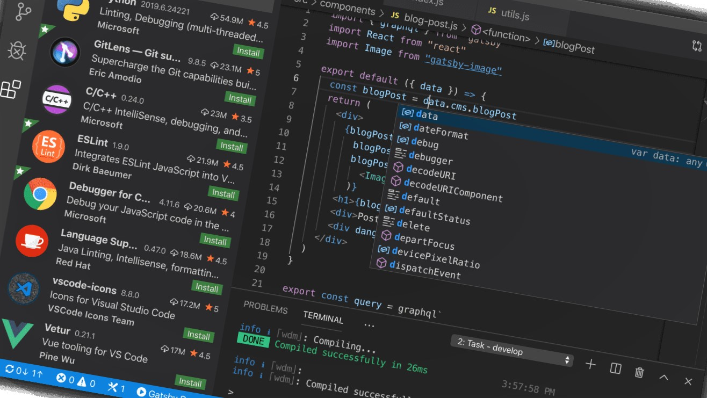
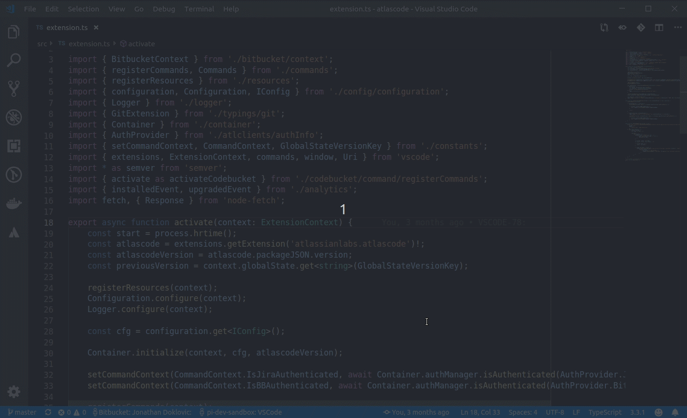
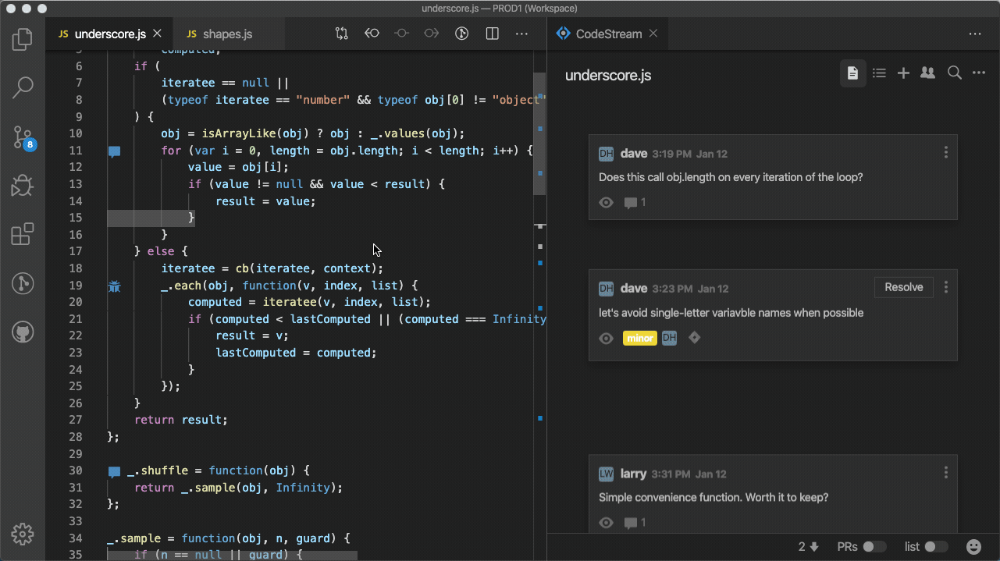

## Edição de texto. Redefinida

Esse é o slogan da página inicial do Visual Studio Code. Na minha jordana, por IDE’s e editores de texto, nenhum deles mudou minha concepção ao que um ambiente completo e integrado pode ser. Seja pela imensidão de extensões disponibilizados pela comunidade e pela microsoft, seja pelo seu design compacto e robusto. O Visual Studio Code, mesmo no mercado a tão pouco tempo, 2015, conseguiu atrair uma grande quantidade de desenvolvedores que buscam por uma solução convidativa e simples.

Comentando sobre extensões, o editor não seria completo sem elas. Apresento aqui 5 extensões e mais algumas extras que podem auxiliar você ou sua equipe no dia a dia.

### [Live share](https://marketplace.visualstudio.com/items?itemName=MS-vsliveshare.vsliveshare-pack)

A ferramenta busca trazer um ambiente colaborativo em tempo real para editar ou debugar código no Visual Code. Trabalhar com um colega de classe ou de trabalho remotamente, seja em pair-programming, revisão de código ou para resolver um problema específico da empresa não é mais um problema. Você se engana se acredita que seja apenas isso, não é um simples editor remoto. Você consegue também, conversar via chat, compartilhar seu servidor e terminal local! Isso mesmo, além disso, você pode até convidar mais de uma pessoa para trabalhar coletivamente.

A extensão vem com um pacote: Live Share, Live Share Audio, Live Share Chat e o Peacock . Que em conjunto traz essa ferramenta incrível para trabalho remoto.

### [Git Lens](https://marketplace.visualstudio.com/items?itemName=eamodio.gitlens)

Eu sabia que estava passando tempo de mais no terminal para realizar os comandos para adicionar, ‘commitar’ e realizar o push. Foi quando percebi que precisava de uma ferramenta para automatizar esse processo, e no percurso saber mais informações do histórico dos meus commits. O Git Lens me acolheu e me deu o poder do Git Supercharged, grandes insights das alterações do código, um histórico de arquivo e linha, além de várias outras ferramentas. Com certeza, se você precisa avançar na utilização do git e precisa de mais dados sobre o progresso do seu codebase, essa é uma ferramenta essencial.

### [Live share whiteboard](https://marketplace.visualstudio.com/items?itemName=MS-vsliveshare.vsliveshare-pack)

Você já não entendeu algum conceito ou explicação, e seu professor ou mentor precisou sair do Visual Code para desenhar em outra ferramenta? A proposta da extensão é justamente essa, ter um ‘Quadro-Branco’ colaborativo dentro do Visual Code, exatamente. Você pode agora, desenhar modelagens de banco de dados relacionais, arquitetura de software, ou mesmo realizar uma apresentação para equipe.

### [Jira and Bitbucket](https://marketplace.visualstudio.com/items?itemName=Atlassian.atlascode)

O Atlassian criou sua própria extensão para o Visual Code Studio. Nela, você consegue ter acesso as Issues e Pull Request do Jira e Bitbucket. Além disso, por ela, você consegue criar suas próprias issues, pull requests, fazer revisão de código entre outras atividades.

### [CodeStream](https://marketplace.visualstudio.com/items?itemName=CodeStream.codestream)

A revisão de código ficou mais fácil com o CodeStream, ele permite que você adicione comentários do código de algum integrante da sua equipe e encaminhar diretamente para o Slack e Gitbucket.

Você consegue discutir blocos de código com sua equipe, deixar perguntas ou comentários em formato de marcação.

## Tem algum para compartilhar

Essas são as que conheço, ferramentas que auxiliam bastante no trabalho remoto ou na produtividade do dia a dia. Se você conhece alguma, deixa um comentário abaixo.

I have an english version too!

- [5 Essential Visual Studio Code Extensions for Collaborative Work](https://dev.to/dheyson/5-essential-visual-studio-code-extensions-for-collaborative-work-59ba)
